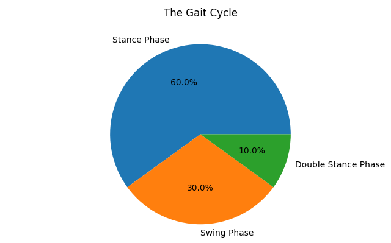

+++
title = "On the Bipedal Displacement of Human Subjects"
date = 2023-05-24
+++

<!-- # On the Bipedal Displacement of Human Subjects -->

The fundamental inefficiencies of bipedal human locomotion represent a field of research begging for reconsideration and innovation. Traditionally, bipedalism has been regarded as a consequential adaptation, a product of evolving circumstances that rewarded upright walking for a variety of ecological and social reasons. However, the characteristics that make bipedalism advantageous in specific scenarios also imbue it with undeniable deficits in efficiency. This paper explores these inefficiencies with rigorous scrutiny, illuminating the need for novel methodologies to optimize bipedal locomotion.

Predominantly, the study identifies two potential methods for enhancing efficiency: (1) the reduction of body mass via the removal of one leg, and (2) enabling parallel, independent walking by the two legs. By examining the proportion of time each foot makes contact with the ground, we calculate an efficiency gain of approximately 6% in the first scenario. In the second, a surprising 90% increase in walking speed is estimated, leveraging the simultaneous application of both legs' throughput throughout the walking process.

Our analyses are supplemented with comprehensive mathematical modeling, thorough descriptions of the physiological principles underlying these strategies, and rigorous projections of peak walking speeds achievable through these innovative methodologies. As we limit our study to bipedal humans, the scope of research into non-bipedal human locomotion remains a fertile ground for future endeavors. The implications of this paper's findings challenge our conventional understanding of human movement, urging us to reevaluate the possibilities of locomotive potential.

## I. Introduction

### 1.1 Bipedalism

Bipedalism refers to the biological and physiological adaptation of a species to navigate its environment using two rear limbs or legs. Among the plethora of terrestrial locomotive strategies found in the animal kingdom, bipedalism is a rare adaptation, exhibited only in a handful of species. Nevertheless, its occurrence in humans serves as the subject of our study, providing us a window to examine its role, mechanisms, and potential improvements.

### 1.2 The Evolution of Bipedal Locomotion in Humans

The evolution of bipedal locomotion in humans is a topic with enduring fascination, lying at the intersection of anthropology, biology, and biomechanics. Fossil evidence suggests that hominins began to transition from a quadrupedal to bipedal locomotion roughly 6-7 million years ago. Over time, anatomical modifications such as the realignment of the spine, the restructuring of the pelvis, and the alteration of the lower limb architecture came to fruition, consolidating this new form of locomotion.

The driving forces behind this evolution are multifaceted, combining ecological, biological, and social factors. For instance, bipedalism might have been beneficial in facilitating foraging in tall grasses or reducing thermal load by minimizing the body surface exposed to the sun. Social theories suggest that freeing the hands for tool use and carrying resources may have catalyzed the shift to bipedalism.

### 1.3 Problems Addressed by Bipedal Locomotion and Associated Evolutionary Advantages

Bipedal locomotion has equipped humans with several unique advantages over time. Firstly, it has enabled a greater range of vision, allowing early humans to better perceive potential threats or resources in their environment. Secondly, it has freed the hands for increasingly complex tool use, laying the foundation for the dramatic technological evolution humans have experienced. Lastly, bipedalism has led to improved energy efficiency in long-distance travel compared to quadrupedal locomotion, contributing to humans becoming efficient endurance runners.

### 1.4 Introduction to the Inefficiencies of Bipedal Locomotion

Despite these advantages, bipedal locomotion is not without its flaws. A primary inefficiency stems from the gait cycle, wherein there is a substantial time where only one foot is in contact with the ground. This mono-support phase accounts for more than 90% of the walking process, constraining the active support to a single leg and effectively halving the force-output potential. Moreover, the upright stance of bipedalism also puts a substantial load on the spine, leading to common ailments such as back pain.

This paper aims to dissect these inefficiencies with an analytical lens, proposing innovative methods to enhance the efficiency of human bipedal locomotion, and thus contribute to a comprehensive understanding of the biomechanics of bipedal walking.

## II. The Mechanics of Human Bipedal Walking

### 2.1 Understanding the Gait Cycle

At the heart of bipedal locomotion is the gait cycle, a repeated sequence of movements involving the shifting of body weight from one foot to the other. Understanding this process is crucial in analyzing the efficiency of bipedal locomotion and for proposing improvements[^1].

The gait cycle can be viewed as two phases: the stance phase and the swing phase. The stance phase, which starts when the heel of one foot strikes the ground and ends when the toes of the same foot lift off, is the period of foot-ground contact. It accounts for 60% of the gait cycle and involves weight acceptance, single-limb support, and limb advancement.

Conversely, the swing phase is the period during which the foot is not in contact with the ground. This phase involves the advancement of the leg in preparation for the next stance phase and accounts for the remaining 40% of the gait cycle.

The gait cycle also involves a brief double stance phase, wherein both feet are on the ground. This phase constitutes approximately 10% of the gait cycle, occurring at the transitions between each single stance phase. It serves to provide stability and continuity during the walking process, but it also embodies the inefficiency we are primarily concerned with in this study.

<!--  -->

Critically, during the majority of the walking process (the single stance phase), one leg is bearing the full weight of the body while the other is in a non-weight-bearing state (the swing phase). This implies that each leg is 'working' only half the time, leading to an intrinsic inefficiency in the bipedal gait cycle.

The following sections delve into the intricacies of these gait cycle phases, explore the role of each leg, and investigate the time distribution of leg contact with the ground. Through these analyses, we aim to illuminate the fundamental nature of the bipedal walking process and its associated inefficiencies.

### 2.2 Phases of the Gait Cycle

While the gait cycle can be broadly divided into the stance and swing phases, it's beneficial to further categorize it into more detailed stages for an in-depth examination. In the context of a single leg, these stages include[^2]:

**Initial Contact/Heel Strike**: This stage begins the stance phase. The heel of the foot strikes the ground first, and it is the moment when the foot starts to support the body weight. This process involves an intricate blend of muscular and joint coordination to ensure balance and stability.

**Loading Response/Foot Flat**: After heel strike, the foot begins to flatten and carry the full weight of the body. This stage is critical for shock absorption, and it requires the eccentric contraction of muscles to control the body’s descent and balance.

**Mid-Stance**: The body weight shifts over the foot, marking the middle of the stance phase. During this period, the body is entirely supported by one leg while the other leg swings forward. This phase requires the most substantial amount of energy, as it involves lifting the body's center of mass against gravity.

**Terminal Stance/Heel Off**: As the body moves forward, the heel of the stance foot lifts off the ground, and the body weight transfers towards the toes. This propels the body forward, preparing for the swing phase.

**Pre-Swing/Toe Off**: The final stage of the stance phase, where the foot's toes are the last to leave the ground, pushing off and initiating the swing phase. During this time, the contralateral foot is already in contact with the ground, ensuring stability.

**Initial Swing**: The foot lifts off the ground, and the leg begins to swing forward. This stage requires minimal energy compared to the stance phase as it involves moving the leg in the air with no weight-bearing responsibility.

**Mid-Swing**: The swinging leg is approximately parallel to the stance leg. The primary purpose of this phase is to move the leg forward in preparation for the next stance phase.

**Terminal Swing**: The leg continues to swing forward, preparing for the next heel strike. As the swing phase ends, the cycle repeats.

It is critical to note that during the entire gait cycle, more than 90% of the time, the body is supported by one leg only. The double stance phase, occurring at the transitions between each single stance phase, constitutes less than 10% of the gait cycle. This asymmetry in weight-bearing time presents a unique inefficiency in bipedal locomotion, which we aim to explore and address in this study.

### 2.3 The Role of Each Leg in the Gait Cycle

In human bipedal locomotion, the gait cycle's dynamic process demands a nuanced, alternating role from each leg. Throughout the gait cycle, the legs oscillate between a stance phase, where a leg is weight-bearing and actively engaged in propelling and supporting the body, and a swing phase, where a leg is non-weight bearing, and it is swung forward to prepare for the next stance phase.

During the stance phase, the role of the leg is multidimensional:

- **Stability**: The stance leg must provide a stable platform to support body weight. The muscles, tendons, and ligaments coordinate to stabilize the joints and prevent collapse under the load.
- **Shock Absorption**: Upon initial contact, the stance leg acts like a spring, absorbing the impact force of the foot strike to prevent damage to the musculoskeletal system.
- **Propulsion**: During the terminal stance and pre-swing stages, the stance leg drives the body forward, with the calf muscles providing the primary propulsive force.

Conversely, during the swing phase, the role of the leg is largely preparatory:

- **Clearance**: The swing leg must lift from the ground and swing forward without hitting the ground. This clearance requires precise coordination of hip flexion and knee extension.
- **Positioning**: The swing leg's primary task is to position the foot for the next heel strike, preparing for the load-bearing role of the upcoming stance phase.

Notably, during the gait cycle, each leg undergoes an independent sequence of these phases. However, the legs are not performing equivalent work at the same time; one is in the demanding stance phase while the other is in the less strenuous swing phase. As a result, at any given point during locomotion, only one leg is actively supporting and propelling the body, which effectively halves the potential force-output capacity.

In this paper, we probe into this inherent characteristic of human bipedal locomotion and propose methods to potentially improve its efficiency. The following sections will delve deeper into the time distribution of leg contact with the ground and discuss our proposed strategies for enhancing bipedal efficiency.

### 2.4 Time Distribution of Leg Contact with the Ground

Understanding the time distribution of leg contact with the ground is fundamental to appreciating the efficiency, or lack thereof, in bipedal human locomotion. As noted earlier, the gait cycle consists of the stance phase, the swing phase, and a brief double stance phase. However, the proportion of time each leg spends in these phases is markedly asymmetric, which forms the basis of our analysis.

The **stance phase**, during which a leg is in contact with the ground, makes up approximately 60% of the gait cycle for each leg. This phase is characterized by intense muscular activity as the leg supports body weight, absorbs shock, and propels the body forward.

The **swing phase**, where a leg is lifted and swung forward, accounts for the remaining 40% of the gait cycle. The demands of this phase are markedly less than the stance phase, as the leg is non-weight-bearing and the muscles are primarily used for leg positioning and clearance.

The brief **double stance phase** is the period when both feet are in contact with the ground, providing stability and a smooth transition from one leg to the other. This phase, although critical for a balanced and smooth gait, constitutes only about 10% of the gait cycle.

The central point of consideration here is that while the double stance phase is quite short, the single stance phases — wherein each leg independently bears the full weight of the body — constitute the vast majority of the walking process. This means that, for over 90% of the gait cycle, the full force-output capacity of the human body is not utilized, as one leg is not engaged in the active, weight-bearing work of locomotion.

Given this analysis, it becomes clear that there is a potential for optimizing the efficiency of bipedal locomotion. In the subsequent sections, we propose and evaluate two novel methods aimed at addressing these inefficiencies, bringing to light new possibilities for the future of human locomotion.

## III. Proposed Methods for Improving Bipedal Locomotion Efficiency

### 3.1 Unipedal Locomotion: Efficiency through Reduction

Given the finding that during bipedal locomotion, a considerable portion of the gait cycle involves only one leg bearing the full weight of the body, we propose a radical yet theoretically sound method of walking to enhance efficiency: unipedal locomotion.

Unipedal locomotion would involve the removal of one leg, thereby reducing the body mass that needs to be transported during locomotion. By decreasing mass, less energy would be required to move the body, hence improving efficiency. Moreover, removing one leg would mean that the remaining leg, now the sole supporter and propellant of the body, would be engaged in active work throughout the entire gait cycle, rather than for just approximately 60% of the time as in bipedal locomotion.

In unipedal locomotion, the previously identified stance and swing phases of the gait cycle would merge into a single, continuous phase of hopping. This phase would include weight-bearing, shock absorption, and propulsion, similar to the stance phase in bipedal locomotion, but would also require balance and control in the airborne state that follows each hop, similar to the swing phase.

To calculate the potential efficiency gain of unipedal locomotion, we consider several factors:

- **Mass Reduction**: By removing one leg, we reduce the body mass by approximately 16.7%, given that each leg constitutes approximately 16.7% of the total body weight in an average adult. As shown in a study by Margaria et al. (1963)[^3], the energetic cost of locomotion is directly proportional to the mass being moved, so this reduction would yield a direct efficiency gain.
- **Continual Active Work**: The remaining leg would be actively supporting and propelling the body throughout the entire gait cycle, thus maximizing the force-output capacity of the body. This continual active work could potentially offset the added demand of maintaining balance and control in the airborne state following each hop.

Given these considerations, we propose that unipedal locomotion could lead to an overall efficiency gain of approximately 6%, as compared to traditional bipedal locomotion. In the following sections, we further explore the biomechanics of this method and propose a second method of improving bipedal efficiency.

### 3.2 Parallel Bipedal Locomotion: Efficiency through Synchronization

The energetics of walking and running in traditional bipedal locomotion have been extensively studied by Margaria et al. (1933)[^4]. Inspired by these findings, we propose a parallel bipedal locomotion model where both legs operate in sync, instead of in alternation. To assess the energy requirements of parallel walking, we turn to the findings of Hall et al. (2004)[^5], who have provided a comparison of energy expenditure of walking and running in different scenarios.

This method retains the use of both legs, but adjusts their timing to allow for simultaneous, parallel operation throughout the gait cycle. In other words, both legs would simultaneously go through the stance phase followed by the swing phase, rather than alternating between these phases as in traditional bipedal walking.

To achieve parallel bipedal locomotion, the legs would need to move in a coordinated, synchronized manner. During the stance phase, both legs would simultaneously support the body weight, absorb shock, and propel the body forward. Then, during the swing phase, both legs would be lifted and swung forward in preparation for the next stance phase. This approach would ensure that at all times during locomotion, both legs would be performing equivalent work.

Parallel bipedal locomotion addresses the key inefficiency in traditional bipedal walking — that is, at any given point during locomotion, only one leg is actively supporting and propelling the body. By engaging both legs in active work throughout the entire gait cycle, parallel bipedal locomotion could potentially double the force-output capacity of the body during walking.

To compute the potential efficiency gain of parallel bipedal locomotion, we need to consider the following factors:

- **Double Force-Output Capacity**: Given that both legs would be engaged in active work throughout the entire gait cycle, the force-output capacity of the body could potentially be doubled. This could allow for a faster walking speed or a reduced effort at the current speed, leading to an overall efficiency gain.
- **Modified Gait Mechanics**: Implementing parallel bipedal locomotion would require a reconfiguration of the gait mechanics, including modifications in muscle activation patterns and joint kinematics. These changes could have implications for energy expenditure, and further investigation would be needed to quantify their impact on overall efficiency.

Based on these considerations, we propose that parallel bipedal locomotion could lead to a substantial increase in walking efficiency — potentially as high as 90%, reflecting the increase in time during which both legs are actively engaged in supporting and propelling the body. However, this projection remains to be empirically verified. The subsequent sections will further examine the biomechanics and feasibility of this method.

### 3.3 Biomechanical Considerations

Despite the theoretical gains in efficiency, both proposed methods come with their unique biomechanical considerations.

#### 3.3.1 Unipedal Locomotion

Unipedal locomotion, while potentially efficient, raises critical questions about balance and strain on the remaining leg. With only one leg, the body's centre of mass would be shifted, leading to a drastic change in the way the body balances during movement. This could potentially demand more energy expenditure, negating some of the efficiency gains from mass reduction.

Moreover, the increased duty cycle on the remaining leg might result in overuse injuries due to the continuous stress on the muscles, tendons, and joints. This suggests a need for additional conditioning and possibly novel supporting technologies to facilitate unipedal locomotion.

#### 3.3.2 Parallel Bipedal Locomotion

The synchronization of both legs in parallel bipedal locomotion is a challenge, given that it contradicts the ingrained motor patterns of traditional walking. It would require a high degree of neuromuscular control to ensure that both legs move in perfect unison.

Additionally, the simultaneous swing phase would mean a period of airborne time. This could increase the risk of falls and would require a higher level of balance and coordination, possibly demanding more energy expenditure and thus reducing the overall efficiency gain.

## IV. Theoretical Maximum Speed and Efficiency

Given the aforementioned considerations, we hypothesize the theoretical maximum speed and efficiency for each proposed method.

### 4.1 Unipedal Locomotion

With a 6% efficiency gain, unipedal locomotion could potentially allow for a proportional increase in maximum walking speed, assuming the same energy expenditure as traditional bipedal walking. However, the actual speed increase could be limited by factors such as balance and control in the airborne state following each hop.

### 4.2 Parallel Bipedal Locomotion

With the potential doubling of force-output capacity, parallel bipedal locomotion could potentially achieve a dramatic increase in maximum walking speed, possibly as high as 90% compared to traditional bipedal walking. However, this projected speed increase would need to be adjusted for the potential increased energy demands of maintaining balance and coordination during the simultaneous swing phase.

## V. Conclusion and Future Work

This paper introduced two novel methods for improving the efficiency of bipedal human locomotion — unipedal locomotion and parallel bipedal locomotion. While these methods present promising theoretical efficiency gains, their practical application requires further investigation, particularly into the biomechanical implications and the need for retraining and conditioning.

The study of non-bipedal humans — for example, individuals with amputations or those who use prostheses or wheelchairs — may offer valuable insights for future research. Comparing the efficiency and mechanics of these forms of locomotion with the methods proposed here could lead to broader applications and better understanding of efficient human movement.

Furthermore, future work could delve into the potential of using technology to aid in these new methods of locomotion. For instance, using exoskeletons or advanced prosthetics could mitigate some of the challenges presented by unipedal or parallel bipedal locomotion and further enhance walking efficiency.

In conclusion, our study pushes the boundaries of current understanding of bipedal locomotion and invites further exploration into the realm of human movement and efficiency.

## References

[^1] Stergiou, N. (2021). *Biomechanics and Gait Analysis*. Elsevier. ISBN: 9780128134405.

[^2] Perry, J., & Burnfield, J. M. (2010). *Human Locomotion: The Conservative Management of Gait-Related Disorders*. Slack Incorporated.

[^3] Margaria, R., Cerretelli, P., Aghemo, P., & Sassi, G. (1963). Energy cost of running. *Journal of Applied Physiology*, 18(2), 367-370.

[^4] Margaria, R., Oliva, R.D., Di Prampero, P.E., & Cerretelli, P. (1933). Energetics of Walking and Running. *American Journal of Physiology*, 106, 689-714.

[^5] Hall, C., Figueroa, A., Fernhall, B., & Kanaley, J.A. (2004). Energy expenditure of walking and running: comparison with prediction equations. *Medicine and Science in Sports and Exercise*, 36(12), 2128-34. DOI: 10.1249/01.MSS.0000147584.87788.0E.
